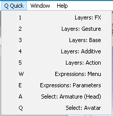
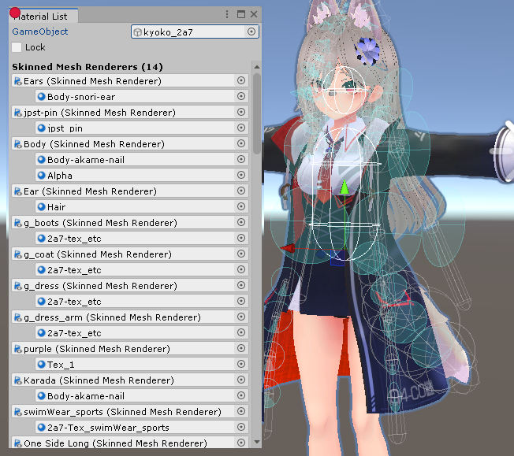
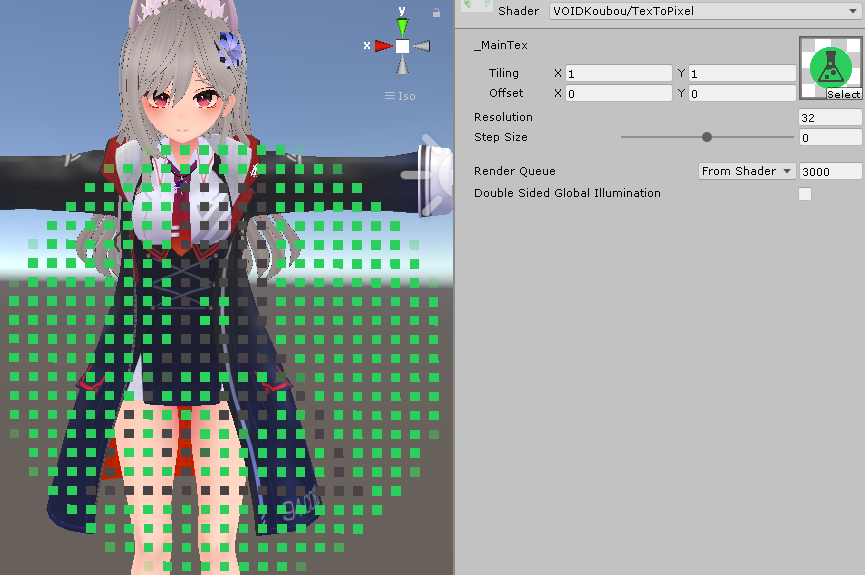
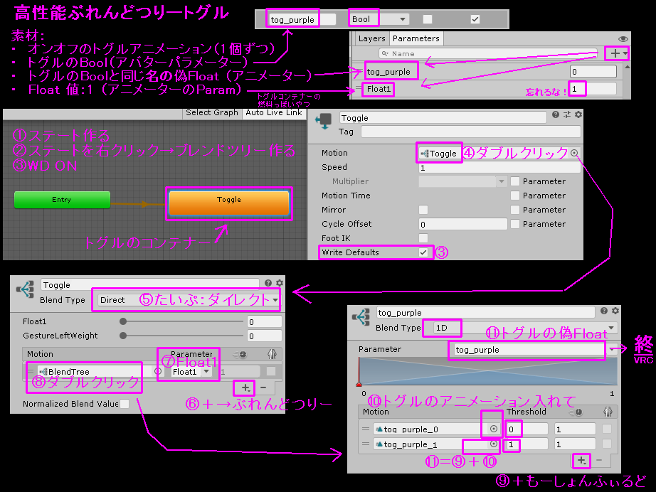

- OpenVR
  - [OSClstrk (SteamVR+VRC Avatar+OSC, C)](https://github.com/GapVR/Unity#osclstrk-steamvrvrc-avatar-c)
- Unity
  - [QuickAvatarMenu (Unity Editor+VRC Avatar)](https://github.com/GapVR/Unity#quickavatarmenu-unity-editorvrc-avatar)
  - [MaterialListTool (Unity Editor)](https://github.com/GapVR/Unity#materiallisttool-unity-editor)
  - [RemoveCrunchCompression (Unity Editor)](https://github.com/GapVR/Unity#removecrunchcompression-unity-editor)
  - [AutoToggleCreator (Unity Editor+VRC Avatar)](https://github.com/GapVR/Unity#autotogglecreator-unity-editorvrc-avatar)
  - [GestureWeightSmooth (VRC Avatar Controller)](https://github.com/GapVR/Unity#gestureweightsmooth-vrc-avatar-controller)
- ShaderLab
  - [LightTrackingVertex.shader](https://github.com/GapVR/Unity#lighttrackingvertexshader)
  - [TexToPixel.shader](https://github.com/GapVR/Unity#textopixelshader)
- Tools
  - [totp2clip.py (Python)](https://github.com/GapVR/Unity#totp2clippy-python)

-----

# OpenVR

## OSClstrk (SteamVR+VRC Avatar+OSC, C)

**[(Download/ダウンロード) OSClstrk_v0.1.zip](https://raw.githubusercontent.com/GapVR/Unity/main/OSClstrk_v0.1.zip)**

- SteamVRでコントローラーのトラッキングがロストされた場合、アバターの腕を自動でアニメーション化するツール
- Utility to set avatar arms to Animation when controller tracking is lost in SteamVR.
- [(Source/ソースコード) OSClstrk.cpp](https://raw.githubusercontent.com/GapVR/Unity/main/OSClstrk.cpp)

# Unity

## QuickAvatarMenu (Unity Editor+VRC Avatar)

**[(Download/ダウンロード) QuickAvatarMenu.cs v0.1](https://raw.githubusercontent.com/GapVR/Unity/main/QuickAvatarMenu.cs)**

- アバター改変でよく使われているもののショートカットキー
- Shortcut keys for commonly used VRC avatar items.
  - ALT+Q + 1～5: Open Animator/アニメーターを開く (1: FX/2: Gesture/3: Base/4: Additive/5: Action)
  - ALT+Q + W: Expressions Menu/アバターメニュー
  - ALT+Q + E: Avatar Parameters/パラメーター
  - ALT+Q + A: Select Head/Headを選択する
  - ALT+Q + Q: Select Avatar/アバターを選択する

## MaterialListTool (Unity Editor)

- 使用されているマテリアルの一覧
- Lists materials used in a GameObject hierarchy.

**[(Download/ダウンロード) MaterialListTool.cs v0.3](https://raw.githubusercontent.com/GapVR/Unity/main/MaterialListTool.cs)**

## RemoveCrunchCompression (Unity Editor)

- プロジェクト全体的にテスクチャファイルの「クランチ圧縮」を無効するツール
- Tool to disable Crunch Compression in all textures.

**[(Download/ダウンロード) RemoveCrunchCompression.cs v0.1](https://github.com/GapVR/Unity/raw/refs/heads/main/RemoveCrunchCompression.cs)**

## AutoToggleCreator (Unity Editor+VRC Avatar)

- アバターのオブジェクトのトグルを作成するツール
- Create toggles for avatar objects.

**[(Download/ダウンロード) AutoToggleCreator.cs](https://raw.githubusercontent.com/GapVR/Unity/main/AutoToggleCreator.cs)**

## GestureWeightSmooth (VRC Avatar Controller)
 
**[(Download/ダウンロード) GestureWeightSmooth.unitypackage](https://raw.githubusercontent.com/GapVR/Unity/main/GestureWeightSmooth.unitypackage)**

**[(Download/ダウンロード) GestureWeightSmooth.zip](https://raw.githubusercontent.com/GapVR/Unity/main/GestureWeightSmooth.zip)**

- [hai-vr CGE](https://github.com/hai-vr/combo-gesture-expressions-av3)

# ShaderLab

## LightTrackingVertex.shader

- 一端を光源に接続するためにメッシュを曲げるシェーダー
- Deforms a mesh to connect one end to a light source.

**[(Download/ダウンロード) LightTrackingVertex.shader](https://raw.githubusercontent.com/GapVR/Unity/main/LightTrackingVertex.shader)**

## TexToPixel.shader

- ドット絵化シェーダー
- Pixellate textures

**[(Download/ダウンロード) TexToPixel.shader](https://raw.githubusercontent.com/GapVR/Unity/main/TexToPixel.shader)**

# Tools|ツール(汎用)

## totp2clip.py (Python)

- 2FAの確認コードをクリップボードに生成するスクリプト
- Generate a verification code for 2FA login and copies it to clipboard.

**[(Download/ダウンロード) totp2clip.py](https://raw.githubusercontent.com/GapVR/Unity/main/totp2clip.py)**

## ~~argrewrite (C)~~

-  (Deprecated/非推奨)

**[(Download/ダウンロード) argrewrite.c](https://raw.githubusercontent.com/GapVR/Unity/main/argrewrite.c)**

**[(Download/ダウンロード) argrewrite-ytdl.zip](https://raw.githubusercontent.com/GapVR/Unity/main/argrewrite-ytdl.zip)**

## ~~vrctimeoututil (cmd.exe)~~ (Deprecated/非推奨)

- (Deprecated/非推奨)
- タイムアウトまたはエラーワールド時にVRCを再起動するツール
- Utility to restart VRC on timeout or error world.

**[(Download/ダウンロード) vrctimeoututil.bat v20230607](https://raw.githubusercontent.com/GapVR/Unity/main/vrctimeoututil.bat)**

## ガイド|Guides (VRC)

### トグルのBlendTree化方法
- [BlendTreeToggleHowTo.png](https://raw.githubusercontent.com/GapVR/Unity/main/BlendTreeToggleHowTo.png) 

# 草|w

**[(Download/ダウンロード) KusaFinder.shader](https://raw.githubusercontent.com/GapVR/Unity/main/KusaFinder.shader)**

- ジャパンストリートの草探し用シェーダー
- Japan Street grass detection shader.
