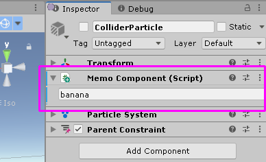
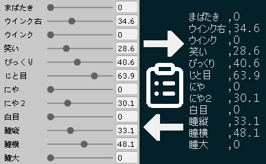
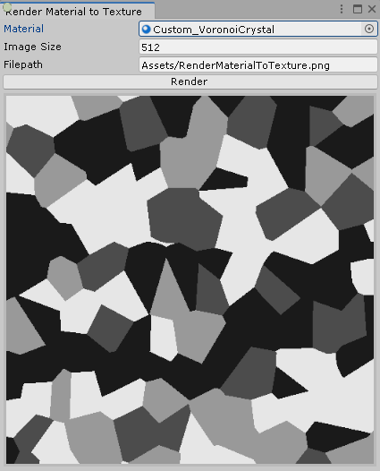

- <b>Unity</b>
  - [Memo Component (Unity Editor)](#memocomponent-unity-editor)
  - [BlendshapeNamedCopyPaste (Unity Editor)](#blendshapenamedcopypaste-unity-editor) 
  - [Render Material To Texture](#render-material-to-texture-unity-editor) 
  - [(Auto) Animation Hierarchy Editor](#auto-animation-hierarchy-editor-unity-editor-fork)
  - [QuickAvatarMenu (Unity Editor+VRC Avatar)](#quickavatarmenu-unity-editorvrc-avatar)
  - [MaterialListTool (Unity Editor)](#materiallisttool-unity-editor)
  - [RemoveCrunchCompression (Unity Editor)](#removecrunchcompression-unity-editor)
  - [AutoToggleCreator (Unity Editor+VRC Avatar)](#autotogglecreator-unity-editorvrc-avatar)
  - [GestureWeightSmooth (VRC Avatar Controller)](#gestureweightsmooth-vrc-avatar-controller)
- <b>ShaderLab</b>
  - [VoronoiCrystal.shader](#voronoicrystalshader)
  - [LightTrackingVertex.shader](#lighttrackingvertexshader)
  - [TexToPixel.shader](#textopixelshader)
  - [NadeShader2.shader](#nadeshader2shader)
- <b>Misc</b>
  - [「チェック全入り肌のマテリアル」Skin Material for Liltoon (Unity)](#%E3%83%81%E3%82%A7%E3%83%83%E3%82%AF%E5%85%A8%E5%85%A5%E3%82%8A%E8%82%8C%E3%81%AE%E3%83%9E%E3%83%86%E3%83%AA%E3%82%A2%E3%83%ABskin-material-for-liltoon-unity)
- <b>OpenVR</b>
  - [OSClstrk (SteamVR+VRC Avatar+OSC, C)](#osclstrk-steamvrvrc-avatarosc-c)
- <b>Tools</b>
  - [totp2clip.py (Python)](#totp2clippy-python)

-----

# Unity

## MemoComponent (Unity Editor)

**[(Download/ダウンロード) MemoComponent.cs](https://raw.githubusercontent.com/GapVR/Unity/refs/heads/main/MemoComponent.cs)**

- メモをコンポーネントに保存する簡単なアドオン
- Save notes in components.

## BlendshapeNamedCopyPaste (Unity Editor)

**[(Download/ダウンロード) BlendshapeNamedCopyPaste.cs](https://raw.githubusercontent.com/GapVR/Unity/refs/heads/main/BlendshapeNamedCopyPaste.cs)**

- ブレンドシェイプ名を使って異なる/変更されたモデルにコピペできるようにするツール
- Copy and paste blendshapes using blendshape name, allowing import/export to different/changed models.
  - Paste (Source: Non-Zero): Import only if the blendshape value in the clipboard is bigger than zero./クリップボードのブレンドシェイプ値が>0の場合のみインポートする
  - Paste (Target: Zero only): Import only if the object's blendshape is zero./オブジェクトのブレンドシェイプがゼロの場合のみインポートする

## Render Material To Texture (Unity Editor)

**[(Download/ダウンロード) RenderMaterialToTexture.cs](https://raw.githubusercontent.com/GapVR/Unity/refs/heads/main/RenderMaterialToTexture.cs)**

- マテリアル(シェーダ)の画像をPNGファイルに出力できるツール
- Save material (shader) output to a PNG image.

## [(Auto) Animation Hierarchy Editor](https://github.com/GapVR/Unity-Animation-Hierarchy-Editor) (Unity Editor, fork)

**[(Download/ダウンロード) AutoAnimationHierarchyEditor.cs 20250307](https://github.com/GapVR/Unity-Animation-Hierarchy-Editor/releases/download/1.0/AutoAnimationHierarchyEditor.cs)**

- 壊れたアニメーションファイルを修正するツール
- Semi-automated tool to fix broken animation paths from missing gameobjects.
- メニュー/Menu : Tools > Auto Animation Hierarchy Editor

## QuickAvatarMenu (Unity Editor+VRC Avatar)

**[(Download/ダウンロード) QuickAvatarMenu.cs v0.2](https://raw.githubusercontent.com/GapVR/Unity/main/QuickAvatarMenu.cs)**

- アバター改変でよく使われているもののショートカットキー
- Shortcut keys for commonly used VRC avatar items.
  - ALT+Q + 1～5: Open Animator/アニメーターを開く (1: FX/2: Gesture/3: Base/4: Additive/5: Action)
  - ALT+Q + W: Expressions Menu/アバターメニュー
  - ALT+Q + E: Avatar Parameters/パラメーター
  - ALT+Q + A: Select Head/Headを選択する
  - ALT+Q + Q: Select Avatar/アバターを選択する
  - ALT+Q + W: Print World Position/グロバル座標の位置を表示する

## MaterialListTool (Unity Editor)

**[(Download/ダウンロード) MaterialListTool.cs v0.3](https://raw.githubusercontent.com/GapVR/Unity/main/MaterialListTool.cs)**

- 使用されているマテリアルの一覧
- Lists materials used in a GameObject hierarchy.

## RemoveCrunchCompression (Unity Editor)

**[(Download/ダウンロード) RemoveCrunchCompression.cs v0.2](https://github.com/GapVR/Unity/raw/refs/heads/main/RemoveCrunchCompression.cs)**

- プロジェクト全体的にテスクチャファイルの「クランチ圧縮」を無効するツール
- Tool to disable Crunch Compression in all textures.

## AutoToggleCreator (Unity Editor+VRC Avatar)

**[(Download/ダウンロード) AutoToggleCreator.cs](https://raw.githubusercontent.com/GapVR/Unity/main/AutoToggleCreator.cs)**

- アバターのオブジェクトのトグルを作成するツール
- Create toggles for avatar objects.

## GestureWeightSmooth (VRC Avatar Controller)
 
**[(Download/ダウンロード) GestureWeightSmooth.unitypackage](https://raw.githubusercontent.com/GapVR/Unity/main/GestureWeightSmooth.unitypackage)**

**[(Download/ダウンロード) GestureWeightSmooth.zip](https://raw.githubusercontent.com/GapVR/Unity/main/GestureWeightSmooth.zip)**

- [hai-vr CGE](https://github.com/hai-vr/combo-gesture-expressions-av3)

# ShaderLab

## VoronoiCrystal.shader

**[(Download/ダウンロード) VoronoiCrystal.shader](https://raw.githubusercontent.com/GapVR/Unity/main/VoronoiCrystal.shader)**

- 2Dボロノイ結晶パターンを生成するシェーダー
- Draws a 2D Voronoi crystal pattern.

## LightTrackingVertex.shader

**[(Download/ダウンロード) LightTrackingVertex.shader](https://raw.githubusercontent.com/GapVR/Unity/main/LightTrackingVertex.shader)**

- 一端を光源に接続するためにメッシュを曲げるシェーダー
- Deforms a mesh to connect one end to a light source.

## TexToPixel.shader

**[(Download/ダウンロード) TexToPixel.shader](https://raw.githubusercontent.com/GapVR/Unity/main/TexToPixel.shader)**

- ドット絵化シェーダー
- Pixellate textures

## NadeShader2.shader

**[(Download/ダウンロード) NadeShader2.shader](https://raw.githubusercontent.com/GapVR/Unity/main/NadeShader2.shader)**

- （深度テクスチャの）距離に基づいて、画面に色付きオーバーレイを描画するシェーダー
- Draws a coloured overlay to the screen based on distance to objects in the world.

# Misc|その他

## 「チェック全入り肌のマテリアル」Skin Material for Liltoon (Unity)

**[(Download/ダウンロード) liltoonskinmaterial250220.png](https://raw.githubusercontent.com/GapVR/Unity/main/liltoonskinmaterial250220.png)**

# OpenVR

## OSClstrk (SteamVR+VRC Avatar+OSC, C)

**[(Download/ダウンロード) OSClstrk_v0.1.zip](https://raw.githubusercontent.com/GapVR/Unity/main/OSClstrk_v0.1.zip)**

- SteamVRでコントローラーのトラッキングがロストされた場合、アバターの腕を自動でアニメーション化するツール
- Utility to set avatar arms to Animation when controller tracking is lost in SteamVR.
- [(Source/ソースコード) OSClstrk.cpp](https://raw.githubusercontent.com/GapVR/Unity/main/OSClstrk.cpp)

# Tools|ツール(汎用)

## totp2clip.py (Python)

**[(Download/ダウンロード) totp2clip.py](https://raw.githubusercontent.com/GapVR/Unity/main/totp2clip.py)**

- 2FAの確認コードをクリップボードに生成するスクリプト
- Generate a verification code for 2FA login and copies it to clipboard.

## ~~argrewrite (C)~~

**[(Download/ダウンロード) argrewrite.c](https://raw.githubusercontent.com/GapVR/Unity/main/argrewrite.c)**

**[(Download/ダウンロード) argrewrite-ytdl.zip](https://raw.githubusercontent.com/GapVR/Unity/main/argrewrite-ytdl.zip)**

-  (Deprecated/非推奨)

## ~~vrctimeoututil (cmd.exe)~~ (Deprecated/非推奨)

**[(Download/ダウンロード) vrctimeoututil.bat v20230607](https://raw.githubusercontent.com/GapVR/Unity/main/vrctimeoututil.bat)**

- (Deprecated/非推奨)
- タイムアウトまたはエラーワールド時にVRCを再起動するツール
- Utility to restart VRC on timeout or error world.

## ガイド|Guides (VRC)

### トグルのBlendTree化方法
- [BlendTreeToggleHowTo.png](https://raw.githubusercontent.com/GapVR/Unity/main/BlendTreeToggleHowTo.png) 

# 草|w

**[(Download/ダウンロード) KusaFinder.shader](https://raw.githubusercontent.com/GapVR/Unity/main/KusaFinder.shader)**

- ジャパンストリートの草探し用シェーダー
- Japan Street grass detection shader.
